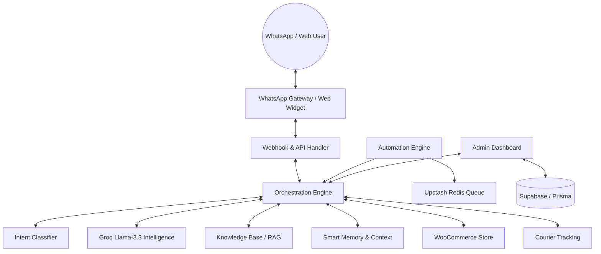

# 🤖 OmniChat — Business Automation Agent

OmniChat is a sophisticated **AI-Driven Business Automation Agent** that transforms customer engagement into a hands-free operational engine. It goes beyond simple chat by integrating directly with **WhatsApp**, **WooCommerce**, and **Courier APIs** to handle everything from product search and sales to proactive delivery tracking and customer retention.

---

## 🏗️ High-Level Architecture

OmniChat operates as a multi-layered ecosystem, separating communication channels from AI intelligence and business logic.



---

## 🌟 Core Capabilities

### 🧠 AI Intelligence & Context
*   **Intent Awareness**: Automatically detects user goals (e.g., searching products, checking order status, or requesting a return).
*   **Persistent Memory**: Remembers customer names, past orders, and preferences for a truly personalized experience.
*   **Dynamic RAG**: Semantic search over your store policies, FAQs, and product catalogs for grounded, accurate responses.

### 🛒 Real-Time Business Execution
*   **WooCommerce Sync**: Direct access to your product catalog, real-time inventory checks, and order creation.
*   **Courier Tracking**: Automated tracking for DHL and local couriers, providing live status updates directly in chat.
*   **Sales Automation**: Guide customers from "Just looking" to "Order confirmed" entirely via WhatsApp.

### ⚙️ Proactive Automation Engine
*   **Delivery Follow-ups**: Automatically asks for reviews after an order is marked completed.
*   **Shipping Delay Alerts**: Proactively notifies customers if an order is stuck in processing for too long.
*   **Re-order Nudges**: Intelligent reminders for customers who haven't ordered their favorite items in a while.

### 📊 Admin Command Center
*   **Real-Time Monitoring**: Track live conversations and automation success metrics.
*   **System Health**: Instant visibility into the status of Meta APIs, WooCommerce, Groq, and Supabase.
*   **Knowledge Manager**: Easy UI to manage the AI's internal knowledge base and vector entries.

---

## 🛠️ Technical Stack

Built with the latest cutting-edge technologies for maximum performance and scalability:

*   **Framework**: [Next.js 16](https://nextjs.org/) (App Router, Server Actions)
*   **Styling**: [Tailwind CSS 4](https://tailwindcss.com/) (Ultra-fast, modern UI engine)
*   **Runtime**: [React 19](https://react.dev/)
*   **Intelligence**: [Groq SDK](https://groq.com/) (Llama-3.3-70b-versatile, Nomic-Embed-Text)
*   **Database**: [Supabase](https://supabase.com/) (PostgreSQL + pgvector)
*   **ORM**: [Prisma](https://www.prisma.io/)
*   **Hardening**: [Upstash](https://upstash.com/) (Redis Queue & Rate Limiting)
*   **Channels**: WhatsApp Business API, Web Chat Widget

---

## 🚀 Getting Started

### 1. Prerequisites
*   Node.js 20+
*   Supabase Project (with pgvector enabled)
*   Groq API Key
*   Meta Developer Account (for WhatsApp Business API)
*   WooCommerce Store with REST API enabled

### 2. Installation
```bash
npm install
cp .env.example .env.local
npx prisma generate
```

### 3. Database Initialization
```bash
npx prisma db push
```

### 4. Running the Development Server
```bash
npm run dev
```

---

## 🤖 Automation Workflows

OmniChat handles the heavy lifting through scheduled tasks:

| Workflow | Trigger | Action |
| :--- | :--- | :--- |
| **Review Collector** | Order marked "Completed" | Sends a personalized thank-you and review request. |
| **Delay Protector** | Order "Processing" > 3 days | Notifies the customer of the delay and offers support. |
| **Loyalty Nudge** | Inactive for 30+ days | Suggests a re-order based on previous purchases. |

---

## 🛡️ License

Private / Internal Business Automation Project. Designed for enterprise scalability and high-conversion customer engagement.
