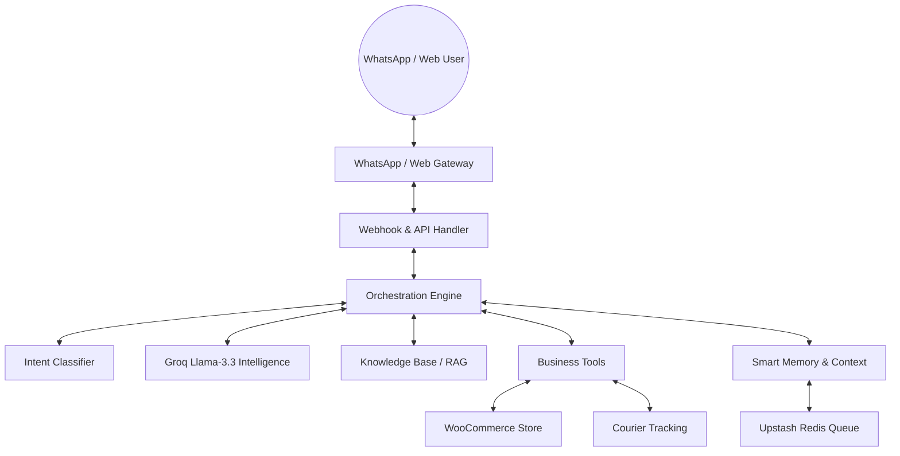

# 🤖 OmniChat — Business Automation Agent

OmniChat is a sophisticated **Business Automation AI Agent** designed to run on **WhatsApp**, **WooCommerce**, and your **Web Dashboard**. It transforms customer support and sales by integrating directly with your store's logic and courier services.

---

## 🏗️ High-Level Architecture

OmniChat operates at the intersection of AI intelligence and business execution.



---

## 🌟 Core Capabilities

### 🧠 AI Intelligence
*   **Intent Detection**: Automatically identifies user goals (e.g., product search, order tracking, returns).
*   **Real-Time RAG**: Context-aware responses using semantic search over store policies, FAQs, and catalogs.
*   **Groq-Powered**: Lightning-fast inference using Llama-3.3-70b for natural, safe, and grounded conversations.

### 🛒 Business Automation
*   **WooCommerce Integration**: Direct access to search products, retrieve order status, and create returns.
*   **Courier Tracking**: Real-time tracking for DHL and local courier services.
*   **Proactive Engine**: Automated WhatsApp triggers for delivery follow-ups, shipping delays, and re-order nudges.

### 📱 Channel Reach
*   **WhatsApp Business**: Full two-way communication gateway with interactive button support.
*   **Web Widget**: A sleek, nano-styled chat widget for your website.

### 📊 Admin Control
*   **Premium Dashboard**: Monitor live conversations, track automation success, and view system health.
*   **Knowledge Manager**: Direct UI to upload, vectorize, and manage the AI's internal knowledge base.

---

## 🛠️ Technical Stack

*   **Frontend**: Next.js 16 (App Router), Tailwind CSS (Nano Design)
*   **Intelligence**: Groq SDK (Llama-3.3-70b-versatile, Nomic-Embed-Text)
*   **Database**: Supabase (PostgreSQL + pgvector), Prisma ORM
*   **Hardening**: Upstash (Redis Queue & Rate Limiting)
*   **Integrations**: WhatsApp Business API, WooCommerce REST v3, DHL Tracking API

---

## 🚀 Getting Started

### 1. Prerequisites
*   Node.js 20+
*   Supabase Project (with pgvector enabled)
*   Groq API Key
*   Meta Developer Account (for WhatsApp)
*   WooCommerce Store with REST API enabled

### 2. Installation
```bash
npm install
cp .env.example .env.local
npx prisma generate
```

### 3. Database Sync
```bash
npx prisma db push
```

### 4. Run Locally
```bash
npm run dev
```

---

## 📖 Documentation

For a detailed, step-by-step walkthrough on configuring WhatsApp, WooCommerce, and Production Hardening, please refer to the:

👉 **[Final Setup Guide](./docs/setup-guide.md)**

---

## 🛡️ License

Private / Internal Business Automation Project.
